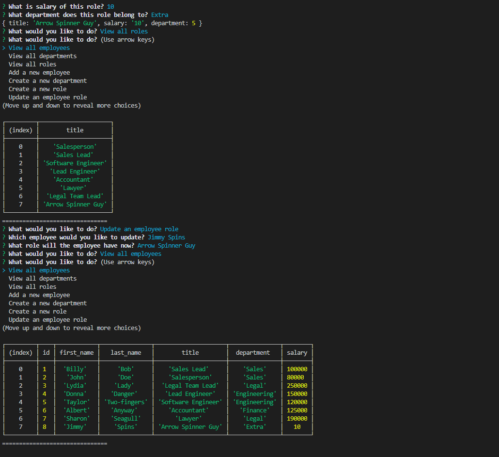

# The Employee Tracker 

## Description 

Manage your employees with this simple tracker! You can manage your employees, roles they can fill, the departments they fall under and their managers. You can update previous employee files to change their roles as well. 

Technologies used:
- JavaScript
- NodeJS
- MySQL
- Inquirer NPM

## Table of Contents

* [Installation](#installation)
* [Usage](#usage)
* [Questions](#questions)
* [License](#license)

## Installation
Nothing needs to be installed!

## Usage 
DEMO VIDEO: https://drive.google.com/file/d/1Hb2gWP96SA09SXYzKde1XOxVvunKuGQx/view

Run the app by going to the terminal of your choice file path'd to the code's location then run "node server.js". Navigate the menues with the arrow keys and enter all the information you are prompted.

## Questions?

Visit me at my GitHub page: https://www.github.com/rgl10d

Or email me: rgl10d@gmail.com

## License

MIT License

Copyright © [2020] [Garrett Lee]

Permission is hereby granted, free of charge, to any person obtaining a copy
of this software and associated documentation files (the "Software"), to deal
in the Software without restriction, including without limitation the rights
to use, copy, modify, merge, publish, distribute, sublicense, and/or sell
copies of the Software, and to permit persons to whom the Software is
furnished to do so, subject to the following conditions:

The above copyright notice and this permission notice shall be included in all
copies or substantial portions of the Software.

THE SOFTWARE IS PROVIDED "AS IS", WITHOUT WARRANTY OF ANY KIND, EXPRESS OR
IMPLIED, INCLUDING BUT NOT LIMITED TO THE WARRANTIES OF MERCHANTABILITY,
FITNESS FOR A PARTICULAR PURPOSE AND NONINFRINGEMENT. IN NO EVENT SHALL THE
AUTHORS OR COPYRIGHT HOLDERS BE LIABLE FOR ANY CLAIM, DAMAGES OR OTHER
LIABILITY, WHETHER IN AN ACTION OF CONTRACT, TORT OR OTHERWISE, ARISING FROM,
OUT OF OR IN CONNECTION WITH THE SOFTWARE OR THE USE OR OTHER DEALINGS IN THE
SOFTWARE.